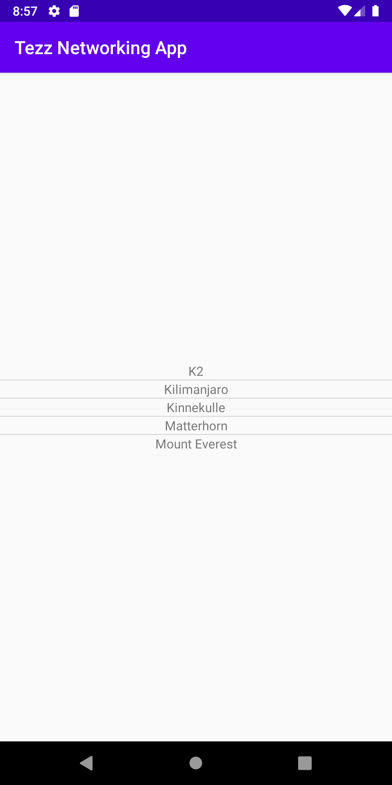
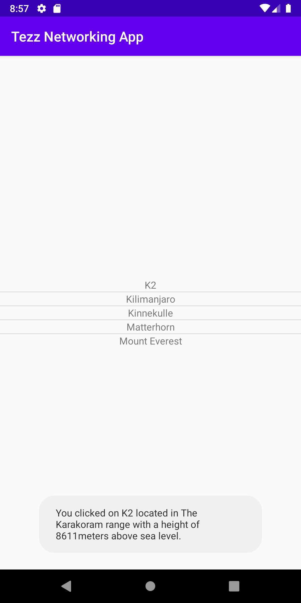

RAPPORT ASSIGNMENT 6

Beskrivning uppgift
Denna uppgift gick ut på att hämta JSON-data från en onlinewebservice och presentera i en lista i
min app. Jag gjorde detta genom att skapa listview och lägga till medlemsvariablerna arraylist och
arrayapadter. Sedan la jag koden förf JsonTask, dependencies for GSON och skapade klasserna för
arrayen Mountain och objektet Auxdata från datan som hämtades från JSON-webservicen. Sedan skapade
jag en designfil till mina listview där jag la till en textview som innehållet ska visas i. I
onPostExecute la jag till oden för initiering av Gson, mouintainarrayen, adaptern och presenterade
det i en listview. I min mountainclass skapade jag en toString där jag specifiserade vad jag ville
visas på skärmen när mina item listades. Jag lekte lite med designen och testade på Linearlayout
som jag inte använt så mycket förut och centererade innehållet till mitten av skärmen. Efter det
skapade jag en OnItemClickListener för min listview och la till en toast i den som visar ett
meddelande innehållande lite text, namnet på berget och två properties för berget.

KODSNUTT FRÅN MIN APP
```
@Override
        protected void onPostExecute(String json) {
            Log.d("MainActivity -->", json);

            Gson gson = new Gson();
            Mountain[] mountainList = gson.fromJson(json, Mountain[].class);

            for (int i = 0; i < mountainList.length; i++) {
                Log.d("MainActivity -->", "Hittade ett berg: " + mountainList[i]);
            }

            mountains = new ArrayList<>(Arrays.asList(mountainList));

            adapter = new ArrayAdapter<Mountain>(getApplicationContext(), R.layout.listview_item, R.id.item, mountains);

            ListView listView = findViewById(R.id.list_view);
            listView.setAdapter(adapter);

            listView.setOnItemClickListener(new AdapterView.OnItemClickListener() {
                @Override
                public void onItemClick(AdapterView<?> parent, View view, int position, long id) {
                    Toast.makeText(MainActivity.this,  "You clicked on " + mountains.get(position).toString() +
                    " located in " + mountains.get(position).getLocation() + " with a height of " + mountains.get(position).getSize() +
                    "meters above sea level.", Toast.LENGTH_LONG).show();
                }
            });
        }
```
Denna kodsnutt visar min onPostExecute som är resultatet efter att appen fått svar med data från
webbservicen. Den visar hur onPostExecute tar in Jsondatan som en string och sedan gör om det till
GSON och lagrar det i en arraylist som heter mountainList. Sedan specificeras apatern och att den
ska hämta layouten från designfilen listview_item och presenterar det i en textview som heter item.
Sedan körs adaptern och den tillhörande OnItemClickListern innehållande en toast.

SCREENSHOTS FRÅN APPEN

Appen som visar en listview med bergsnamnet från hämtad JSON-data från webserven.



Appen som visar både listviewn och toasten som visas när man klickar på berget K2.


